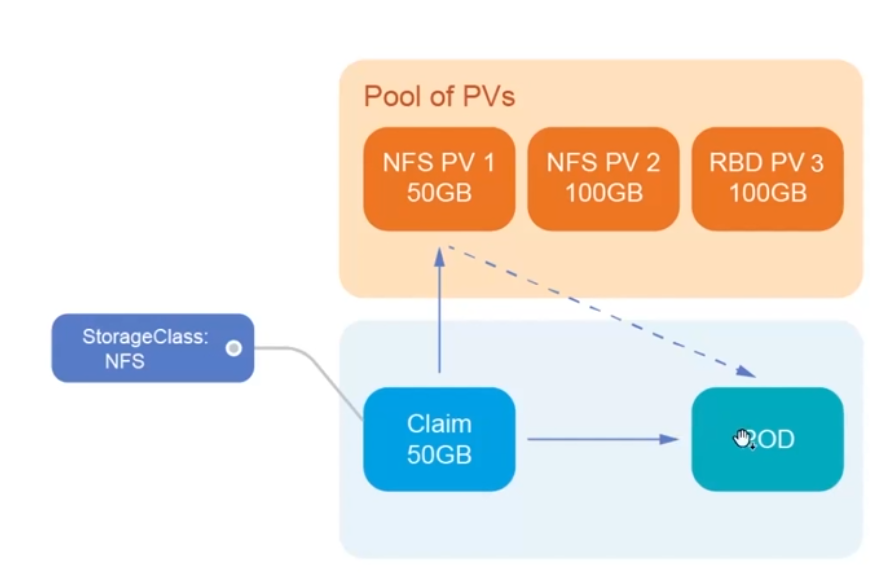
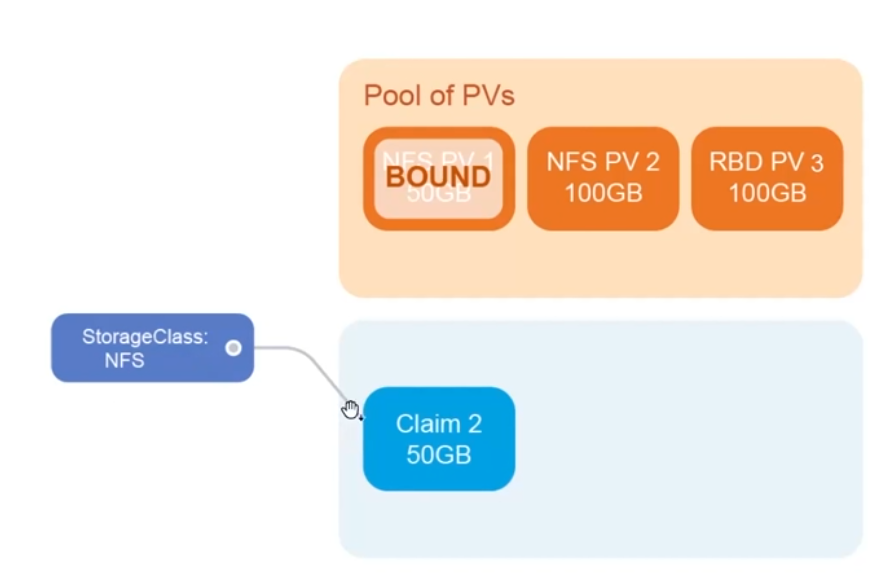
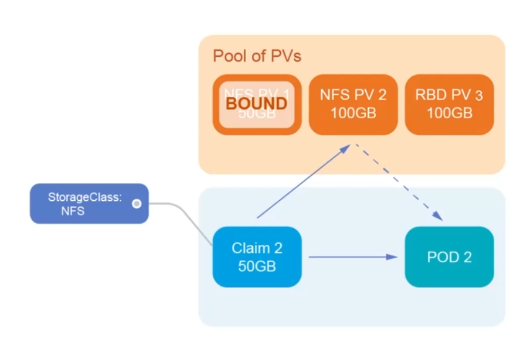
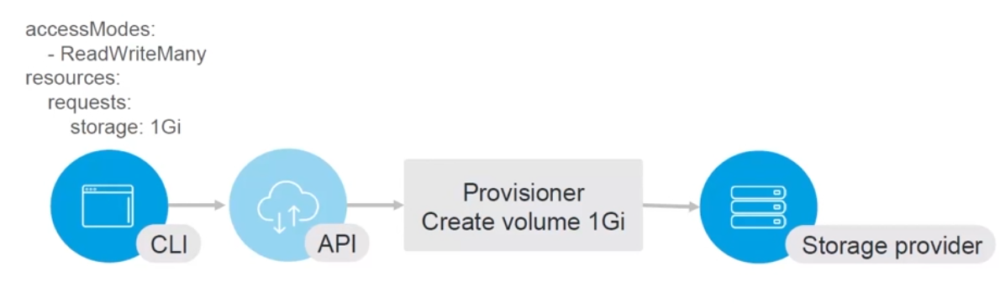
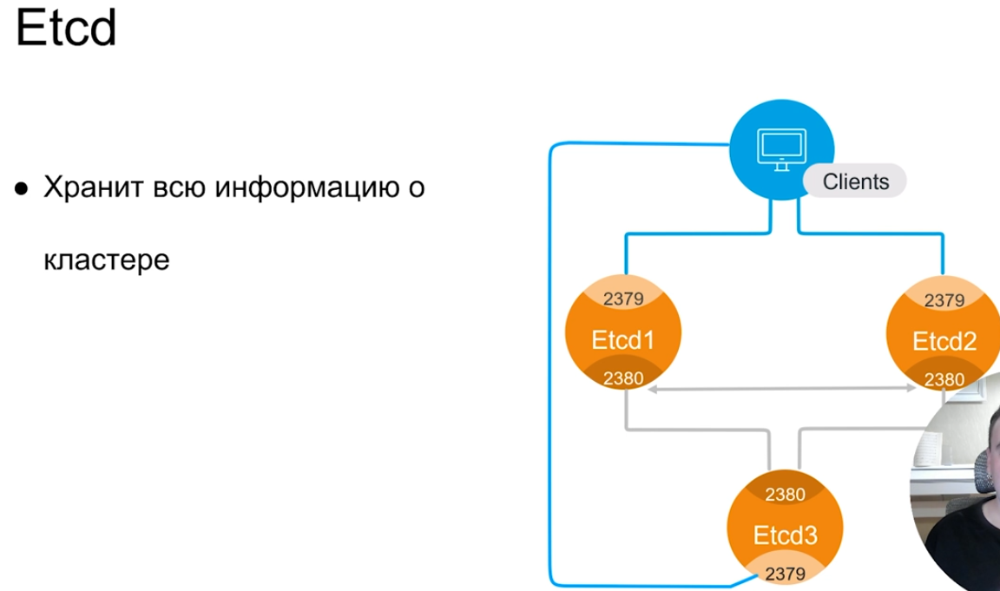

Хранение данных

Храните данные в БД, а файлы в S3

---

PV PVC

---

Init Containers

Используются для какой-то функциональности перед запуском основных контейнеров (выдача прав на что-либо или другая надстройка)
Выполняются по порядку в манифесте
Можно монтировать те же тома, что и в основных контейнерах
Можно запускать от другого пользователя
Должен выполнить действие и остановиться

---

Ingress and Services

Чтобы service работал, нужно 2 условия:

- Service и PODS в одной namespace
- Селектор соответствовал labels, на которые нужно отправлять трафик

---

Etcd

БД k8s, которая поддерживает qvorum, Необходимо минимум 3 реплики. Благодаря этому механизму можем потерять 1 из node, а 2 оставшиеся будут работать.

---

API Server

- Центральный компонент K8s
- Единственный кто общаетс с Etcd
- Работает по REST API (общаться по API протоколу)
- Authentication and Authorization

---

Controller Manager

Набор контроллеров (компоненты, выполняющие какую-то работу):

- Node controller
- Replicaset controller
- Endpoints controller
  GarbageCollector

---

Scheduler

Назначает PODы на NODы учитывая:

- QoS (назчанает поды на ноды в соответствии с классами)
- Affinity/anti-affinity (учитывает, какие должно стоять рядом, а какие нет)
- Requested resources (нагрузка примерно одинаковая по умолчанию)
- Priority Class (на какую конкретную ноду назначить под)

---

Kubelet

Работает на каждой ноду кластера
Единственный компонент, работающий не в Docker
Отдаёт команды Docker daemon
Создаёт PODы на NODах

---

Kube-proxy

Смотрит в Kube-API
Стоит на всех серверах
Управляет сетевыми правилами на нодах
Реализует Service (ipvs, iptables)

---

/etc/kubernetes/manifests - самые важные компоненты системы, без которых работа k8s будет не полноценной
