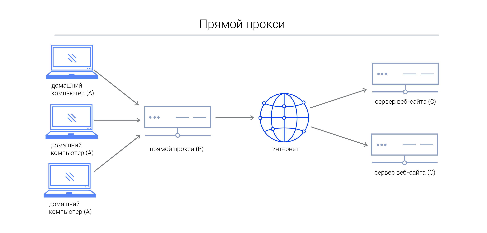
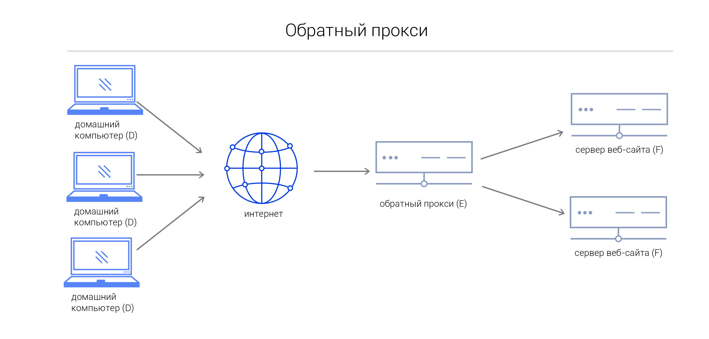

### Proxy

**Прямой прокси (Forward Proxy)**:

- **Определение**: Это сервер, который вы используете, чтобы получить доступ к интернету через него. Ваши запросы направляются через прокси-сервер перед тем, как они достигнут интернет-ресурса.
- **Пример**: Представьте, что у вас на работе есть прокси-сервер, через который вы обращаетесь к интернету. Когда вы заходите на какой-то сайт, ваш запрос сначала отправляется на этот прокси-сервер, который затем передает его на сайт и возвращает вам ответ.

**Обратный прокси (Reverse Proxy)**:

- **Определение**: Это сервер, который работает на стороне сервера, к которому вы обращаетесь. Он принимает запросы от клиентов и передает их соответствующим серверам, обслуживающим контент.
- **Пример**: Представьте, что вы пользуетесь интернет-магазином. Когда вы делаете запрос на сайт, ваш запрос сначала идет к обратному прокси-серверу. Этот сервер может проверить запрос, а затем направить его к соответствующему серверу магазина, который хранит запрашиваемый контент (например, страницу товара). Это позволяет распределять нагрузку и обеспечивать безопасность.

