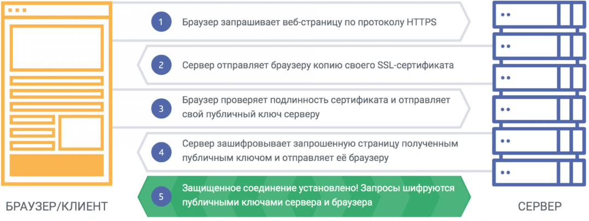

### SSL

SSL сертификат - цифровой сертификат, удостоверяющий подлинность веб-сайта и позволяющий использовать зашифрованное соединение.

### Как работает Certbot:

1. **Установка Certbot**: Вы начинаете с установки Certbot на вашем сервере. Certbot доступен для большинства распространенных операционных систем и веб-серверов.
2. **Получение сертификата**: После установки Certbot вы запускаете его, указывая домен(а), для которого вы хотите получить сертификаты. Certbot взаимодействует с серверами Let's Encrypt, проверяя ваше право на домен и запрашивая SSL/TLS-сертификаты.
3. **Подтверждение владения доменом**: Certbot использует различные методы для подтверждения, что вы владеете доменом, для которого запрашивается сертификат. Это может включать в себя размещение специальных файлов на вашем веб-сервере, изменение DNS-записей или использование альтернативных методов, таких как DNS-01 или HTTP-01.
4. **Получение и установка сертификата**: После успешной проверки владения доменом Certbot получает SSL/TLS-сертификаты от Let's Encrypt и автоматически настраивает ваш веб-сервер для использования этих сертификатов.
**Автоматическое обновление**: Certbot также предоставляет механизм автоматического обновления сертификатов. Сертификаты Let's Encrypt имеют срок действия 90 дней, поэтому Certbot рекомендует настраивать автоматическое обновление, чтобы сертификаты всегда оставались действительными.
**Интеграция с веб-сервером**: Certbot пытается интегрироваться с вашим веб-сервером (например, Apache, Nginx), чтобы упростить процесс настройки HTTPS. Однако, если интеграция не поддерживается, Certbot также может создавать конфигурационные файлы для вас, которые вы можете вручную добавить к вашему веб-серверу.

**Что такое протокол ACME?**

Автоматизированная среда управления сертификатами (ACME) - это стандартный протокол для автоматизации проверки домена, установки и управления сертификатами X.509.
